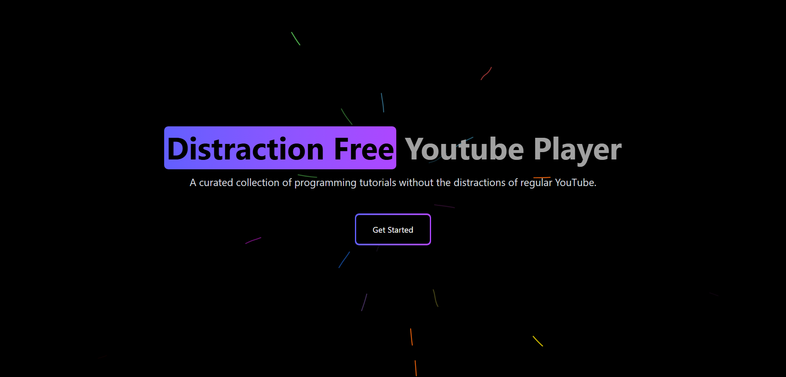

# <span style="font-family: 'Boreal', 'Jano Sans Pro', 'Roboto', sans-serif; font-weight: 700;">‎ ‎ ‎ ‎ ‎ ‎ ‎ ‎ ‎‎ ‎ ‎ ‎ ‎ ‎ ‎ ‎ ‎ ‎ ‎ ‎ ‎ ‎ ‎ ‎ ‎ ‎  ‎ ‎ ‎ ‎‎Distraction Free</span>  <span style="font-family: 'Boreal', 'Jano Sans Pro', 'Roboto', sans-serif; font-weight: 700;">Player</span>

<div align="center">
  
</div>

 ### Welcome to the **Distraction Free YouTube Player**, a platform developed for focused and optimized learning with YouTube videos!

## Platform Features

- **Ad-Free Experience**: Watch tutorials without any advertisements
- **Curated Content**: Handpicked programming tutorials from top educators
- **Open Source**: Community-driven development, free for everyone
- **Distraction-Free**: Clean interface without recommendations or comments
- **Multiple Playlists**: Organized learning paths for different technologies
- **Saved Progress**: Resume where you left off with automatic progress tracking
- **Focused Learning**: The interface is tailored for maximum concentration
- **Optimized Performance**: Fast loading and smooth playback

## Tech Stack

- React.js
- Tailwind CSS
- YouTube Data API
- Framer Motion
- React Player


## Setup Guide

To get started with the **Distraction-Free YouTube Player**, follow these steps:

1. **Clone the repository**:
   ```bash
   git clone https://github.com/hotheadhacker/youtube-player.git
   cd youtube-player
   ```

2. **Copy the example environment file**:
   ```bash
   cp .env.example .env
   ```

3. **Add your API key**:
   Open the `.env` file and replace `your_api_key` with your actual YouTube API key.

4. **Install the dependencies**:
   ```bash
   npm install
   ```

5. **Run the development server**:
   ```bash
   npm run dev
   ```

   This will start the application locally. Open [http://localhost:5173](http://localhost:5173) to view it in your browser.

## Contributing

We welcome contributions to make this platform even better! Here's how you can help:

1. Fork the repository
2. Create your feature branch (`git checkout -b feature/AmazingFeature`)
3. Commit your changes (`git commit -m 'Add some AmazingFeature'`)
4. Push to the branch (`git push origin feature/AmazingFeature`)
5. Open a Pull Request

Please ensure your PR description clearly describes the changes and their benefits.

## Credits

Platform designed by [Salman Qureshi](https://isalman.dev) and redesigned by [Zaid Adil](https://hothead.vercel.app).

## Source Code

Check out the source code on GitHub: [hotheadhacker/youtube-player](https://github.com/hotheadhacker/youtube-player)

---

Thank you for using the Distraction-Free YouTube Player! If you find it helpful, please consider giving it a star ⭐
